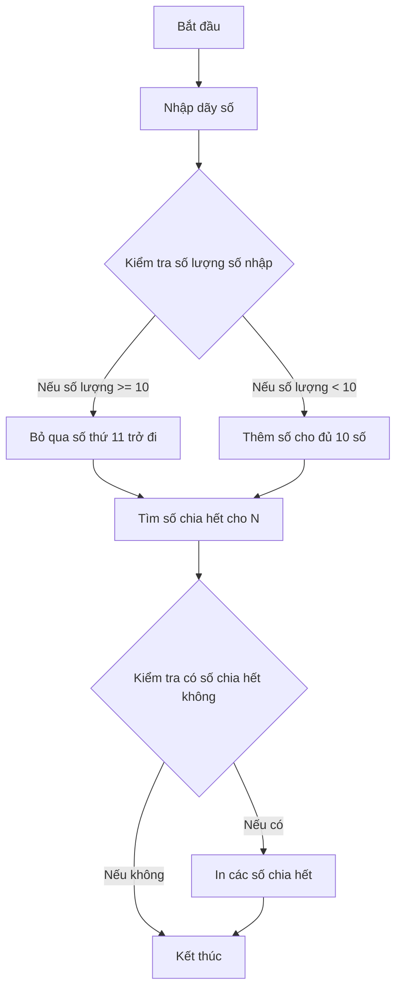

```mermaid
graph TD;
    A[ Bắt đầu ] --> B[Nhập dãy số];
    B --> C{Kiểm tra số lượng số nhập};
    C -- Nếu số lượng >= 10 --> D[Bỏ qua số thứ 11 trở đi];
    C -- Nếu số lượng < 10 --> E[Thêm số cho đủ 10 số];
    D --> F[Tìm số chia hết cho N];
    E --> F[Tìm số chia hết cho N];
    F --> G{Kiểm tra có số chia hết không};
    G -- Nếu có --> H[In các số chia hết];
    G -- Nếu không --> I[Kết thúc];
    H --> I;
```
