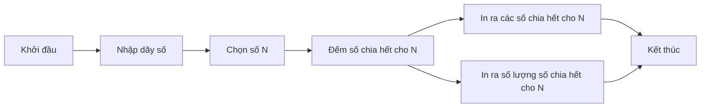

```mermaid
graph LR
A[Khởi đầu] --> B[Nhập dãy số]
B --> C[Chọn số N]
C --> D[Đếm số chia hết cho N]
D --> E[In ra các số chia hết cho N]
E --> F[Kết thúc]
D --> G[In ra số lượng số chia hết cho N]
G --> F
```
